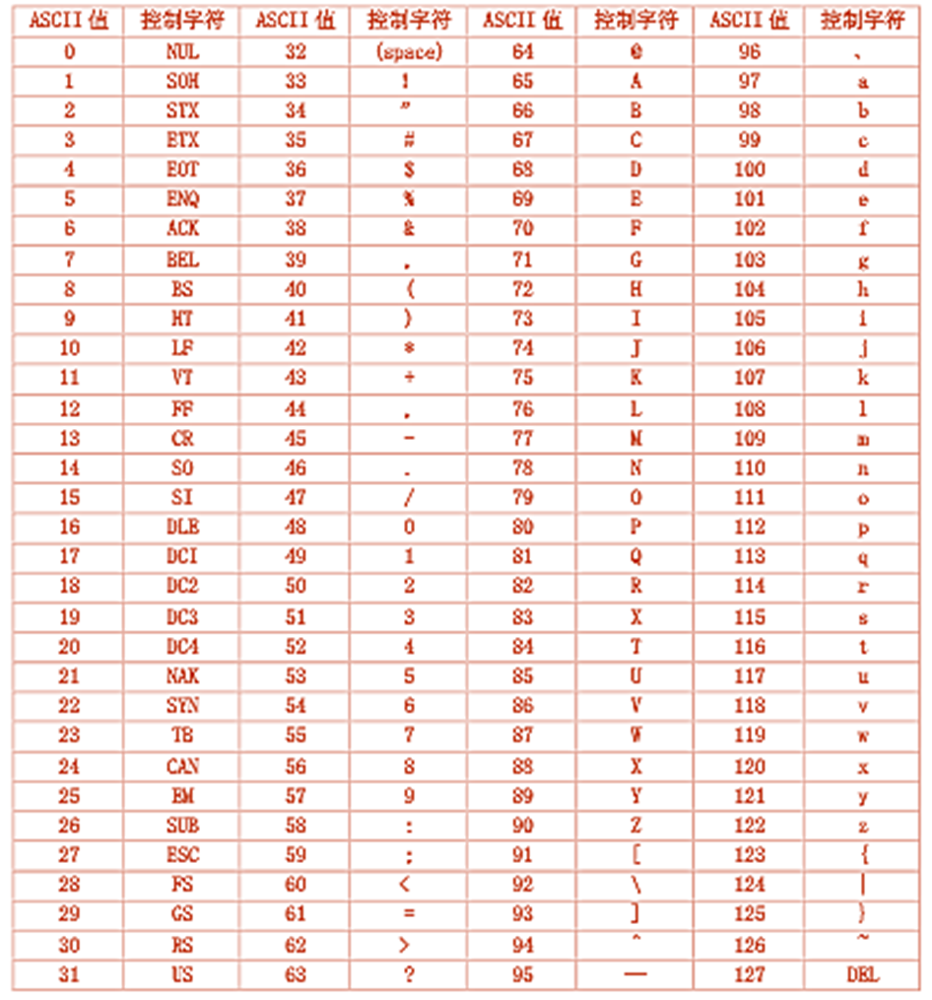
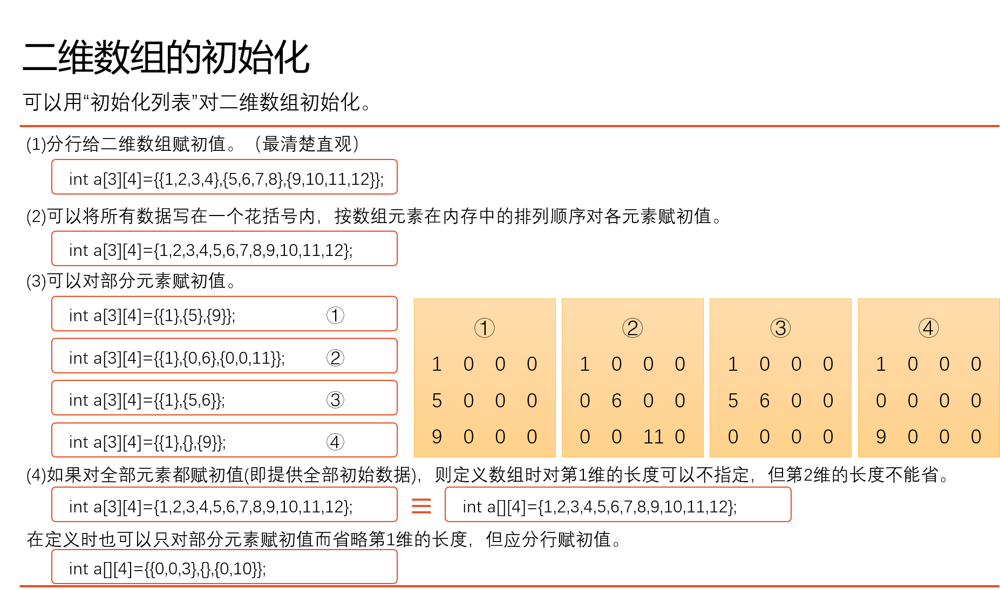

# 第一章 起始课
## 一、计算机语言
- 机器语言：01
- 汇编语言：符号
- 高级语言：更接近自然语言（如C语言）

## 二、C语言历史
D.M.Ritchie 设计

## 三、程序
### 内容输出
- 函数：C的功能片段（名称后+小括号），括号内写函数参数
- `int`：函数类型，为整型
- `\n`：转义字符，表换行
- `//`：单行注释
- `/* 多行内容 */`：多行注释
在printf双引号中加注释没用

**记得用英文输入法**

```C
#include <stdio.h>  //编译预处理指令
//standard input optput 头文件，定义了宏、常量等函数（预定义的库）

int main()  //定义主函数，每次都是从这开始
{
   printf("Hello, World!\n");   //输出信息
   return 0;    //执行后的返回值
}
```

### 整数求和
- `%d`：指定输出格式，d表示按“十进制整数”形式输出
- `+ - * / %`：加 减 乘 除 取余

```C
#include <stdio.h>
int main()
{
    int a , b , sum; //声明a、b、sum为整型变量，**使用前先声明**
    a = 123;    //赋值（记录数值）
    b = 456;
    sum = a + b;
    printf("求和值sum为 %d\n",sum);
    return 0;
}
```

### 比较数值

```C
#include <stdio.h>
int main()
{
    int max(int x,int y);   //声明自己写的函数
    int a , b , c;
    scanf("%d,%d",&a,&b);    //输入变量a、b的值
    c = max(a,b);
    printf("较大的为：%d\n",c);
    return 0;
}

int max(int x, int y)   //定义max函数，值为整型
{
    int z;
    if(x > y)
     z = x;  //if和else只管一句话
    else
     z = y;
    return(z);
    /*if和else成对，各只有一句，可以不用{}*/
}
```
`True` 用1表示；`False` 用0表示
所以如果a取值非零，`if(a == 1)`也可以写成`if(a)` （如果 a 非零则为真；0 则为假）

## 四、C语言程序的结构
- 一个程序由一个或多个源程序文件（如`.c`后缀文件）组成，源程序文件包括：预处理指令、全局声明、函数定义
- 函数是C程序的主要组成部分，必须包含唯一一个`main`函数
- 一个函数包括==函数首部==和==函数体==，函数体包括声明部分和执行部分
- 程序总是从`main`函数开始执行
- 程序中的操作是由函数中的C语句完成的
- 每个数据声明和语句的最后**必须有一个分号`;`**
- C语言本身不提供输入输出语句，由函数完成

数据：描述对象
## 五、运行C程序的步骤
[编译 → 连接] → 执行

# 第二章 算法

## 选修：流程图、伪代码
本部分考试不考

# 第三章 语法

## 顺序程序设计

### ℉转换为℃
- `float`：浮点数，可以装小数（6 位），计算出小数需要 `1 / 2.0` 而非 `1 / 2`，后者结果为 `0`
- `%f`：浮点数替换
- 浮点型和整型混合运算，按精度更高的输出

```C
#include <stdio.h>
int main()
{
    float f,c;
    f = 64.0;
    c = (5.0 / 9) * (f - 32);   //如果把5.0改成5，结果会变成整型，导致输出结果错误
    printf("f=%f\nc=%f",f,c);
    return 0；
}
```

### 计提存款利息

## 数据类型
### 基本类型
#### 整型类型：

C语言数据的表现形式为：常量&变量
常量：
- 整型常量
- 实型常量：`e`、`E` 后的数字指10的几次方
- 字符常量：`''` 单引号，只包含一个字符（普通/转义字符）
`1`数字1；`'1'`字符1
- 字符串常量：`""` 双引号
- ==符号常量==：`#define PI 3.1416` 定义 `PI` 的值为…
    - 预编译时直接替换为数值
- 转义字符：
    - `\n`：换行
    - `\r`：回车符
    - `\t`：水平制表符，隔开后可分列
    - `\v`：垂直制表符
    - `\a`：报错响一下
    - `\`：单引号
    - `\"`：双引号
    - `\?`：问号
    - `\\`：反斜线

变量：
代表有名字的、有特定属性的存储单元（包含名称、数值、地址）
如 `scanf("%d",&a)` 中 `&a` 表示a的地址
- ==常变量==：`const int a = 3` a的值为3，不会改变
    - 预编译时还是个“变量”，与符号常量最终结果相同
- 标识符：为标识变量、符号常量、函数、数组、类型等起的名字
    - 只能由字母、数字、下划线组成，第一个字符必须为字母/下划线
    - 不能用C语言中的关键字起名字

#### 整型数据：
- `int`：4字节，可以装（-2^31^~2^31^-1）
- `unsigned`：4字节，可以装（0~2^32^-1）
- `short`：2字节，短整型，可以装（-2^15^~2^15^-1），约3万
- `long long`：8字节，可以装（-2^63^~2^63^-1）

short < int < long < long long

- `%u`：输出无符号整型数据
- `%d`：按“十进制整数”形式输出

#### 字符型数据：

与 ASCII 字符集相同
- `A`对应值65
- `a`对应值97
==二者间差32== **必考，记忆值**

之后的字母类推（如`B`对应66）
- `%c`：输出字符型数据
- 也可以将字符型数据按`%d`输出，当整数用

例：大写转小写
```C
#include <stdio.h>
int main()
{
    int a,b;
    scanf("%c",&a);
    a = a + 32;
    //这里也可以写成 a = a +'b'-'B'，这里二者相减差也是32
}
```

#### 浮点型数据：
小数点位置可以浮动，所以实数的指数形式称为“浮点数”
一位存符号，多位存有效数字，再多位存指数
- `float`：4字节，6位有效数字   `%f`
    - 用它装整数更多
- `double`：8字节，15位有效数字 `%lf`
- `long double`：同上，或16字节，19位有效数字   `%lf`

### 常量类型
- `'n'` 字符常量
- `23` 整型常量
- `3.14159` double型
可以在常量末尾加专用字符，强制指定类型 `float a = 3.14159f`

## 运算符和表达式
按优先级排序：
- ()
- 算术运算符：`* / + -  % ++ --`：乘 除 取余 加 减 自加 自减
    - `+a` 正号运算符，返回a的值（单目运算符）
    - `-a` 负号运算符，返回负的a的值
    - ==`++i` 使用 i 之前先加1== **必考，注意顺序**
    - `i++` 使用 i 之后再加1
- 关系运算符：`> < >= <= == !=` ，后两个优先级低
`d = 2 > 1` d的值为1（真），先算比较
- 逻辑运算符：`! && ||`：非 与 或
    - 非：逆反，若 `a` 为假，则 `!a` 为真
    例：`if((year % 4 == 0 && year % 100 != 0)||year % 400 == 0)` 第二组括号不用加，先算取余，之后判断是否为0，再看and，最后看or
    - 与：左边为假，直接短路。两边都为真，结果为1；有一边为假，结果为0。
    - 或：左边为真，直接短路
    `&&` 比 `||` 优先级高。
- 赋值运算符：`=`

[C语言运算符的优先级](https://zhuanlan.zhihu.com/p/13390239271)

算术表达式：
结合性：运算对象两侧的运算符优先级别相同时，运算符的结合方向（左/右结合性）。具体情况具体分析

混合运算：
精度从高
字符型 `char` 与整型 `int` 混合，把字符型当作 ASCII 中数字运算

强制类型转换：
`(类型名)(表达式)` 如 `(int)x + y` 仅转换x为整型，再与y相加，转化为强行取整舍弃小数
可以防止精度不同导致报错

复合赋值运算符
优先级很低
`a+=3` = `a=a+3`
`x*=y+3` = `x=x*(y+8)`
`x%=3` = `x=x%3`

## C程序结构
- C程序
    - 源程序文件1
        - 预处理指令
        - 数据声明
        - 函数1
            - 函数……
    - 源程序文件2……

## C语句
控制语句
函数调用语句
表达式语句
空语句： `;` 什么也不做
复合语句

```C
#include <stdio.h>
#include <math.h>
int main()
{
    double a,b,s,c;
    a = 2;
    b = 4;
    s = a * b;
    c = sqrt(b);
    printf("%f",c);
}
```

变量赋值：
```C
int a,b,c;
a=b=c=3;    //正确

int a=b=c=3;    //错误，没声明b、c
```

### printf
例：输入输出
```C
#include <stdio.h>
#include <math.h>

int main()
{
    double a,b,c;
    scanf("%lf%lf%lf",&a,&b,&c);
    printf("x1=%7.2f\n");    //共输出7位，小数点后保留两位
    return 0;
}
```
格式字符：
`%d` 整数
`%c` 字符型
`%u` 无符号数
`%s` 字符串
`%f` 浮点数
`%e` 或 `%E` 以指数形式输出实数
`%g` 或 `%G` 输出%f或%e中较短的

附加字符：
- `l`长整型整数，可以加在d、u前面
- `%m.nf`
    `m`数据最小宽度
    `n`输出n位小数
- `-`输出的数字靠左

例：输出double型16位小数
```C
#include <stdio.h>
#include <math.h>

int main()
{
    double a;
    a=1/3.0;
    printf("%20.16f\n",a);
}
```

### scanf
格式字符：同上
附加字符：
`l`
`h`

字符型函数：
```C
putchar(c);     //输出一个字符，c可以是字符/整型

char a;
a = getchar();  //输入一个字符
```

# 第四章 选择结构程序设计
#### if语句：
```C
#include <stdio.h>
int main()
{
    float a,b,t;
    scanf("%f,%f",&a,&b);
    if(a > b){
        t = a;
        a = b;
        b = t;
    }
    printf("%5.2f,%5.2f\n",a,b);
    return 0;
}
```

if的多种格式
```C
if()   //没有else

if()   //有else
else

if()   //多个判断
else if
else
```
#### 条件表达式（？表达式）：
`max = (a>b)?a:b` 先判断 `?` 前的，若为**真**就运行 `:` 前面的，不然就运行 `:` 后面的
与
```C
if(a>b)
    max = a;
else
    max = b;
```
等价

#### switch语句：
`switch` 语句用于执行**多分支条件判断**，特别适用于固定值匹配的情况。它比 `if-else` 语句结构更清晰，适用于需要**匹配整数**或**字符常量**的情况。

```C
switch (option) {   //变量 option
    case 1: // case后只能跟常量
        printf("选择了选项 1\n");
        printf("这里可以执行多行语句不用{}\n")
        break;
    case 2:
    case 3: //可以多个case共用一个语句
        printf("选择了选项 2 或 3\n");
        break;
    default:    // 没有efault就啥都不做
        printf("无效选项\n");
}
// 判定变量option与后面的值匹配，相等就执行
```

switch 与 if-else 对比
| **特性** | **switch 语句** | **if-else 语句** |
|----------|----------|---------|
| 适用场景         | 适用于**固定值匹配**（整数或字符） | 适用于**范围判断、复杂条件** |
| 可用数据类型      | `int`、`char` | 任意类型 |
| 是否支持范围判断 | ❌ 不支持  | ✅ 支持 |
| 代码可读性      | 更清晰（适合多个固定选项） | 可能较长（尤其是多个 `if-else`） |
| 执行效率        | 在某些编译器中可能更快 | 取决于优化策略 |

---

✅ 适合用 switch 的场景：
•	固定枚举值匹配（如菜单选项、键盘输入、状态机等）。
•	代码逻辑较简单，避免 if-else 过多导致可读性降低。
❌ switch 不适用的情况：
•	判断范围（如 if (x > 10 && x < 50)）。
•	非整数或字符（如 float、double、字符串）。
•	复杂逻辑（如多个 &&、|| 组合）。

注意：
- switch 语句适用于多个固定值匹配的情况（int 或 char）
    - char型，要注意 `case 'a':` 的引号
- case 只能是常量，且不支持范围判断（如 case x > 5）
- 避免 fall-through，要加 `break;` ，否则会**继续执行**下一个 case 代码块。

#### 一维数组：
```C
#include <stdio.h>

int main() {
    // 数据类型 数组名[数组大小];
    int arr[5] = {10, 20, 30, 40, 50};

    /* 创建了一个包含 5 个元素的一维整数数组：
       arr[0]  arr[1]  arr[2]  arr[3]  arr[4]
        10      20      30      40      50
    */

    // 一维数组中的元素可以通过 数组名[索引] 来访问
    printf("arr[1] = %d\n", arr[1]);  // 输出 20
    printf("arr[3] = %d\n", arr[3]);  // 输出 40

    // 使用 for 循环 遍历一维数组：
    printf("数组中的元素：");
    for (int i = 0; i < 5; i++) {  // 遍历数组
        printf("%d ", arr[i]);
    }
    printf("\n");  // 换行

    return 0;
}
```

#### 二维数组：
```C
#include <stdio.h>

int main() {
    //数据类型 数组名[行数][列数];
    int matrix[2][3] = {
        {1, 2, 3},
        {4, 5, 6} 
    };

    /*创建了个2行3列的二维整数数组 {(0,0)起始，第一行为[0]}
    matrix[0][0]  matrix[0][1]  
    matrix[1][0]  matrix[1][1]  
    matrix[2][0]  matrix[2][1]
    */

    //二维数组中的元素可以通过 数组名[行索引][列索引] 来访问。
    printf("matrix[0][1] = %d\n", matrix[0][1]);  // 输出 2
    printf("matrix[1][2] = %d\n", matrix[1][2]);  // 输出 6

    //通常使用 两层 for 循环 遍历二维数组：
    for (int i = 0; i < 2; i++) {  // 遍历行
        for (int j = 0; j < 3; j++) {  // 遍历列
            printf("%d ", matrix[i][j]);
        }
        printf("\n");  // 换行
    }

    return 0;
}
```

#### fgets()
`fgets()` 是 C 语言 中用于读取**一整行字符串**的函数，它可以安全地接收带空格的输入，避免 `scanf("%s", str);` 不能读取空格的问题。
```C
char *fgets(char *str, int size, FILE *stream);
```
- `str`：目标字符数组（存储输入的字符串）。将输入的内容写入这个数组
- `size`：读取的最大字符数。读取 `size - 1` 个字符，最后自动加 `\0` 终止符。
- `stream`：输入流，
    - 通常为 `stdin`（标准输入）
    - 支持文件输入（见下）

```C
#include <stdio.h>

int main() {
    char str[50];  // 定义字符数组

    fgets(str, sizeof(str), stdin);  // 读取输入
    /*,读取字符数量（此处为自动计算整个数组的大小，这里也可以写数字）,*/

    str[strcspn(str, "\n")] = '\0';  // 读取后带换行符\n,如需要去掉换行符

    // 如果输入的内容超出了 size-1，fgets() 只读取 size-1 个字符，剩余部分仍留在输入缓冲区,需要手动清空缓冲区
    int c;
    while ((c = getchar()) != '\n' && c != EOF);  // 清除缓冲区

    printf("你输入的是: %s", str);  // 输出字符串
    return 0;
}
```

逐个字符读取，而不是整行：
```C
#include <stdio.h>

int main() {
    char ch;
    while ((ch = getchar()) != EOF) {  // 逐字符读取
        putchar(ch);
    }
    return 0;
}
```
读取文件：
```C
#include <stdio.h>

int main() {
    FILE *fp = fopen("test.txt", "r");  // 以只读模式打开文件
    if (fp == NULL) {
        printf("文件打开失败\n");
        return 1;
    }

    char line[100];
    while (fgets(line, sizeof(line), fp)) {  // 逐行读取
        printf("%s", line);
    }

    fclose(fp);
    return 0;
}

```
`fgets()` 与 `scanf()`
| **函数**   | **特点** | **能否读取空格** | **需要限制输入大小** | **适用于** |
|---|---|---|---|---|
| `scanf()`  | 读取单词，遇到空格停止 | ❌ 否 | ❌ 不安全，可能溢出 | 单个单词输入 |
| `fgets()`  | 读取整行，包括空格 | ✅ 是 | ✅ 限制长度，安全 | 读取整行 |

#### fabs()
`fabs()` 是 C 语言标准库中用于**求浮点数的绝对值**的函数，定义在 `<math.h>` 头文件中。
```C
#include <math.h>
double fabs(double x);
```
参数：`x` —— 一个 `double` 类型的数值
返回值：返回 `x` 的绝对值，类型仍为 `double`

整数 `int` 型：
```C
#include <stdlib.h>
int x = -10;
printf("%d\n", abs(x));  // 输出 10
```

# 第五章 循环
### while循环
先判断，再运行
```C
int i,sum = 0;
scanf("%d",&i);
while(i < 10)
{
    sum = sum + i;
    i++;
}
printf("%d",sum);
```
i = 1  (<10)，sum = 10；
i = 11 (>10)，sum = **0**

### do…while循环
先运行，再判断
```C
int i,sum = 0;
scanf("%d",&i);
do
{
    sum = sum + i;
    i++;    //先运行一遍循环，再判断条件是否符合
}
while(i < 10);  //注意这个分号
printf("%d",sum);
```
i = 1  (<10)，sum = 10；
i = 11 (>10)，sum = **11**
如果while后面的表达式一开始就为假(0值)时，两种循环的结果是不同的。

### for循环
执行固定次数的循环,
```C
for (初始化; 条件; 更新) {
    // 循环体
}
```
- 初始化：**只执行一次**，用于设置循环变量的初始值。
- 条件：**每次循环前检查**，如果为 `True`（非 0），执行循环体；否则跳出循环。
- 更新：**每次循环结束后执行**，通常用于修改循环变量。

#### 例1: break & continue
```C
for(int i = 1;i < 10;i++)
{
    if(i % 3 == 0)
    continue;
    printf("%d",i);
    if(i % 5 == 0)
    break;
}
//输出值：1245
```
- `continue;` ：结束当前这次循环（而非整个循环），即跳过循环体中下面尚未执行的语句，转到循环体结束点之前
- `break;` ：结束整个循环，使流程跳到循环体之外，接着执行循环体下面的语句

#### 例2：九九乘法表
```C
#include <stdio.h>

int main() {
    for (int i = 1; i <= 9; i++) {
        for (int j = 1; j <= i; j++) {
            printf("%d×%d=%2d ", j, i, i * j);
        }
        printf("\n");
    }
    return 0;
}
```

#### 例3：素数判断
```C
#include <stdio.h>

int main()
{
    int n,i;
    scanf("%d",&n);
    for (i = 2;i < n;i++)
    if (n % i == 0)
    break;
    if(i < n)
    printf("不是素数");
    else
    printf("是素数");
    return 0;
}
```

#### 例4：找出100 ~ 200间的所有素数，用==加标志==的方法：
```C
#include <stdio.h>
int main()
{
	int n,i,t;
	for (n = 100;n <= 200;n++)
	{
        t = 1;  //每轮重置标志t
		for (i = 2;i < n;i++)
		{
			if (n % i == 0)
			{
				t = 0;  //改变标志
				break;
			}
		}
		if (t == 1) //检测标志
		printf("%d ",n);
	}
	return 0;
} 
```

# 第六章 数组
## 一维数组
数组：一组有序数据的集合
S~15~ : 数组名 + 下标（确定数组中的元素）

`int a[10];` ：定义一维数组(类型说明+指定元素个数)
- 包含10个整型元素（0 ~ 9）
- **不能再次出现** `[10]`

`x = a[5];` ：引用一维数组元素
- 此处引用了第**6**位元素

数组的初始化：
- `int a[10] = {0,1,2,3,4,5,6,7,8,9}` ：全部赋值
- `int a[10] = {0,1,2,3}` ：前4个元素赋值，后6个元素自动赋值为0
- `int a[10] = {0}` ：全为0
- `int a[] = {0,1,2,3}` ：自动创建个4位数组

## 二维数组
计算机中数组是连续存放的
二维数组可以看作特殊的一维数组：
`float a[3][4]` 可以看作 `a[0]`为一个元素，每个元素又包含4个元素

==二维数组**第二下标**不能省略 `a[][4]`==

## 字符数组
`char c[10];` ：定义字符数组，这里必须放**常量**（具体的数值）
- 字符型数据由整数（ASCII）形式存放，因此也可用int型存放
#### 赋值
```C
char str[6] = {'h', 'e', 'l', 'l', 'o', '\0'}; // 明确包含 '\0'
//等价于：
char str[] = "hello";  // 自动推导大小，添加 '\0'
```
`\0` 为结束符，数组长度要**多出一位**装结束符
`' '` 字符，只能包含一个字母/符号
`" "` 字符串，可以包含多个字母/符号

#### 输入
- `scanf("%s", str);` ：不能输入空格，**可能导致缓冲区溢出**，==这里不用加 `&`==
- ` fgets(str, sizeof(str), stdin);` ：读取一整行，包括空格，但会保留换行符 `\n` ，需手动去掉
    - `str[strcspn(str, "\n")] = '\0';` ：去掉换行符

#### 输出
`printf("字符串为: %s\n", str);` 直接写数组名，打印第一个 `\0` 之前的内容

#### 长度计算 复制 连接
```C
#include <stdio.h>
#include <string.h>  // 引入字符串处理函数

int main() {
    char str[] = "Hello";
    printf("字符串长度: %ld\n", strlen(str)); // 输出 5，不包括 '\0'

    char str2[20];
    strcpy(str2, str);  // 复制 str 中的内容到 str2 中,但不会检查目标数组是否足够大，可能导致缓冲区溢出！
    //数组名是常量，不能用 = 直接赋值

    strncpy(str2, str, sizeof(str2) - 1); //最后一位数值指定复制的最大长度（此处为 str2位数减一）
    str2[sizeof(str2) - 1] = '\0';  // 确保以 '\0' 结尾


    strcat(str, str2);  // 连接 str 和 str2 到 str 里，注意 str 必须足够大以容纳 str2 的内容
    printf("拼接后的字符串: %s\n", str);

    return 0;
}
```
#### 比较字符串
`strcmp()` 返回值
- `0`：相等
- `< 0`：`str1` 小于 `str2`
- `> 0`：`str1` 大于 `str2`

可以使用`strncmp(str1, str2, 3);` 限制比较长度（此处只比较前3个字符）

```C
#include <stdio.h>
#include <string.h>

int main() {
    char str1[] = "apple";
    char str2[] = "banana";

    if (strcmp(str1, str2) == 0)
        printf("字符串相等\n");
    else if (strcmp(str1, str2) < 0)
        printf("str1 小于 str2\n");
    else
        printf("str1 大于 str2\n");

    return 0;
}

```
#### 转换大小写
`strlwr()` 转换小写
`strupr()` 转换大写

## `puts()` 输出字符串的函数
将字符串输出到终端，输出内容可以包含转义字符，直到遇到 `\0` 将其替换为 `\n` 结束。

## `gets` 输入字符串的函数
输入一个字符串到字符数组
```C
char str[100];
gets(str);
puts(str);
```

## 排序
### 起泡法排序

例1：对10个数排序
```C
#include <stdio.h>
int main()
{
	int a[10];
	int i,j,t;
	for (i = 0;i < 10;i++)
		scanf("%d",&a[i]);  //输入排序数
	printf("\n");

	for (j = 0;j < 9;j++)	//每一轮保证倒数第n个数最大,这里{}可以不加
	{
		for(i = 0;i < 9 - j;i++)
		{
			if(a[i] > a[i+1])
			{	
				t = a[i];
				a[i] = a[i+1];
				a[i+1] = t;
			}
		}	
	}	
	
	for(i = 0;i < 10;i++)   //输出排序结果
	    printf("%d ",a[i]);
	printf("\n");
	return 0;
} 
```

### 选择排序法

先将10个数中最小的数与a[0]对换;再将a[1]~a[9]中最小的数与a[1]对换……每比较一轮,找出一个未经排序的数中最小的一个。共比较9轮。

将10个数从小到大排序
```C
#include <stdio.h>
int main()
{	void sort(int array[],int n);
    int a[10], i;
    
    printf("enter array:\n");
    for(i = 0; i < 10; i++)
        scanf("%d",&a[i]);
    sort(a,10);	//调用sort函数,a为数组名，大小为10
    // 此处传递的是a的指针，sort操作会改变数组a内的值

    printf("The sorted array:\n");
    for(i = 0; i < 10; i++)
        printf("%d ",a[i]);
    printf("\n");
    return 0;
} 

void sort(int array[],int n)
{	int i, j, k, t;
    for(i = 0; i < n - 1; i++)  //0 ~ n-1 都确定是由小到大排序了，n也自己确定了
    {	k = i;            //初始值
        for(j = i + 1; j < n; j++)
            if(array[j] < array[k])
                k = j;    //i之后所有元素和i比，比i小就换给k
        t = array[k];
        array[k] = array[i];
        array[i] = t;
    }
}
```
程序应包含：
算法 一步步实现；
查错；
解释代码；
实现内容；

# 第七章 用函数实现模块化程序设计
每个函数写几个功能，写多个函数，通过多个函数实现目标
效果：清晰、精炼、简单、灵活
如果函数在 `main` 后面出现，需要在主函数中**声明函数**

C编译时以源文件为单位进行编译
所有函数都是平行的，即在定义函数时是分别进行的，是互相独立的。**定义函数不能嵌套**，相互独立，可以互相调用

## 函数分类
### 按用户使用角度
#### 库函数
系统提供的
#### 自己定义的函数

```C
#include <stdio.h>
#include "Another.c"    //声明另一个程序
int main()
{
    void programme();   //声明函数类型
    programme();        //调用函数
    return 0;
}

void programme()    //定义函数（包含具体内容）
{
    printf("aaaaa");
}
```
- 函数的首行(即函数首部)称为函数原型(function  prototype)，包含了检查调用函数是否合法的基本信息(函数名、函数值类型、参数个数、参数类型和参数顺序)。

### 按函数的形式
#### 无参函数
主调函数不向被调用函数传递数据
```
类型名 函数名()
{
    函数体
}
```

调用时直接作为单独语句就行

#### 有参函数
主调函数通过参数向被调用函数传递数据
```
类型名 函数名(形式参数表列)
{
    函数体
}
```
调用时把返回值接下来 `a = programme(b,c)`

## 函数调用
1. 函数调用语句
把函数调用单独作为一个语句。如printf_star();
这时不要求函数带回值，只要求函数完成一定的操作。
2. 函数表达式
函数调用出现在另一个表达式中，如c=max(a,b); 
这时要求函数带回一个确定的值以参加表达式的运算。
3. 函数参数
函数调用作为另一个函数调用时的实参。如 `m=max(a,max(b,c));`，又如 `printf (″%d″, max (a,b));`

函数可以嵌套调用、递归调用（直接或间接调用本身）

例：计算阶乘
```C
int fac(int n)
{
    int f;
    if(n < 0)   //分类讨论
    printf("error");
    else if(n == 0 || n == 1)
    f = 1;
    else
    f = fac(n - 1) * n;
    return(f);
}
```

## 返回值
如果 `return` 的类型和承接的类型不同，会转换为承接的类型

通过return语句将函数值带回到主调函数。应当注意返回值的类型与函数类型一致。如果函数不需要返回值，则不需要return语句。这时函数的类型应定义为void类型。

## 形参&实参
| **形式参数** | **实在参数** |
|---|---|
|变量|常量、变量、表达式、数组元素|
|数组|数组|

```C
int main()
{
    int max(int x,int y);   //函数括号中的变量：形参（虚拟参数）
    int a,b,c;              //实参
    c = max(a,b);           //实参，将 a、b 的值复制给了 max 函数，而非直接把 a、b 传过去。在 max 函数中的操作不影响 main 中 a、b 的值
}

int max(int x,int y)
{
    int z;
    z = x > y ? x:y;
    return(z);
}
```

数组元素可以用作**函数实参**，但是不能用作形参。因为形参是在函数被调用时临时分配存储单元的，不可能为一个数组元素单独分配存储单元(数组是一个整体，在内存中占连续的一段存储单元)

例：找数组最大值及对应的位置
```C
for(i = 1, m = a[0], n = 0;i < 10;i++>)
{
    if(max(m,a[i]) > m)
    {
        m = max(m,a[i]);    //值传递不改变原来的值
        n = i;
    }
}

int max(int x;int y)
{
    return(x > y ? x:y)
}
```

例：传递数组
```C
float aver,score[10];
aver = average(score);

float average(float array[])    //实参，子函数操作会改变数组值;可以不给数组长度
{
    float aver, sum = array[0];
    for(int i = 1;i < 10;i++)
    
}
```

传递二维数组：
`int max(int array[][4])` **列数**必须声明
传递时直接 `max(a)` 就行，与一维数组相同

(1) 用数组名作函数参数，应该在主调函数和被调用函数分别定义数组。
(2) 实参数组与形参数组类型必须一致。
(3) C语言编译系统并不检查形参数组大小，只是将实参数组的首元素的地址传给形参数组名。
(4) 形参数组可以不指定大小，在定义数组时在数组名后面跟一个空的方括号。

## 局部变量 & 全局变量
每一个变量都有一个作用域问题，即它们在什么范围内有效。

### 局部变量
1. 在函数的开头定义：
只在**定义它的函数中**有效。其他函数中不能直接引用形参。
2. 在函数内的复合语句内定义：
这些变量只在本复合语句中有效，这种复合语句也称为“分程序”或“程序块”。

### 全局变量
1. 在函数的外部定义：
可以为本文件中其他函数所共用。它的有效范围为从定义变量的位置开始到本源文件结束。

可以利用**全局变量**来增加**函数间**的联系渠道，通过函数调用能得到一个以上的值。
习惯：全局变量名的第 1 个字母用大写表示

```C
#include <stdio.h>
float a = 3, b; //全局变量
int main()
{
    int a = 8;  //此处又定义了个局部变量，会屏蔽全局变量（这里a的值改为8了）
}
```

#### 非必要不使用全局变量：
① 全局变量在程序的**全部执行过程中都占用存储单元**，而不是仅在需要时才开辟单元。
② 它使函数的通用性降低了。在程序设计中，在划分模块时要求模块的“内聚性”强、与其他模块的“耦合性”弱。*即模块的功能要单一（不要把许多互不相干的功能放到一个模块中），与其他模块的相互影响要尽量少，而用全局变量是不符合这个原则的*一般要求把C程序中的函数做成一个相对的封闭体，除了可以通过“实参—形参”的渠道与外界发生联系外，没有其他渠道。这样的程序移植性好，可读性强。
③ 使用全局变量过多，会降低程序的清晰性，人们往往难以清楚地判断出每个瞬时各个外部变量的值。由于在各个函数执行时都可能改变外部变量的值，程序容易出错。因此，要限制使用全局变量。

## 变量的存储方式和生存期
### 静态存储方式
在程序运行期间由系统分配固定的存储空间的方式。
- 全局变量全部存放在静态存储区中，在程序开始执行时给全局变量分配存储区，程序执行完毕就释放。在程序执行过程中它们占据固定的存储单元，而不是动态地进行分配和释放。
### 动态存储方式
在程序运行期间根据需要进行动态的分配存储空间的方式
- 函数形式参数。在调用函数时给形参分配存储空间。
- 函数中定义的没有用关键字static声明的变量，即自动变量。
- 函数调用时的现场保护和返回地址等。

## 存储类别
C的存储类别包括4种: 

#### 自动的（auto）
函数中的形参和在函数中定义的局部变量（包括在复合语句中定义的局部变量），都属于此类
在调用该函数时，系统会给这些变量分配存储空间，在函数调用结束时就自动释放这些存储空间。
不写auto则隐含指定为“自动存储类别”

#### 静态的（statis）
对静态局部变量是在编译时赋初值的，即**只赋初值一次**，在程序运行时它已有初值。以后每次调用函数时不再重新赋初值而只是**保留上次函数调用结束时的值**。而对自动变量赋初值，不是在编译时进行的，而是在函数调用时进行的，每调用一次函数重新给一次初值，相当于执行一次赋值语句。

希望函数中的局部变量的值在函数调用结束后不消失而继续保留原值，即其占用的存储单元不释放，在下一次再调用该函数时，该变量已有值（就是上一次函数调用结束时的值）时使用

如果在定义局部变量时不赋初值的话，则对静态局部变量来说，编译时自动赋初值0（对数值型变量）或空字符′\0′（对字符变量）。而对自动变量来说，它的值是一个不确定的值。这是由于每次函数调用结束后存储单元已释放，下次调用时又重新另分配存储单元，而所分配的单元中的内容是不可知的。


它是局部变量，只能被本函数引用，而不能被其他函数引用。

如果函数中的变量只被引用而不改变值，则定义为静态局部变量(同时初始化)比较方便，以免每次调用时重新赋值。

例：输出 顺序阶乘
```C
int main()
{
    int fac(int n);
    for(int i = 1;i <= 5;i++)
    printf("%d!=%d\n",i,fac(i));
    return 0;
}
int fac(int n)
{
    static int f = 1;
    f = f * n;
    return(f)
}
```

#### 寄存器的（register）
由于对寄存器的存取速度远高于对内存的存取速度，因此这样做可以提高执行效率。这种变量叫做寄存器变量，用关键字register作声明

经常、频繁使用的变量，可以用register声明（编译器也可以智能识别）

3种局部变量的存储位置是不同的: 自动变量存储在动态存储区；静态局部变量存储在静态存储区；寄存器存储在CPU中的寄存器中。

#### 外部的（extern）。
一般来说，外部变量是在函数的外部定义的全局变量，它的作用域是从变量的定义处开始，到本程序文件的末尾。在此作用域内，全局变量可以为程序中各个函数所引用。但有时程序设计人员希望能扩展外部变量的作用域。

如果外部变量不在文件的开头定义，其有效的作用范围只限于定义处到文件结束。 在定义点之前的函数不能引用该外部变量。如果由于某种考虑，**在定义点之前的函数需要引用该外部变量**，则应该在引用之前用关键字extern对该变量作“外部变量声明”，表示把该外部变量的作用域扩展到此位置。有了此声明，就可以从“声明”处起，合法地使用该外部变量。

用extern声明外部变量时，类型名可以写也可以省写。例如，“extern int A,B,C;”也可以写成“extern A,B,C;”。因为它不是定义变量，可以不指定类型，只须写出外部变量名即可。

# 第八章 指针
内存区每个字节都有一个编号——“地址”
地址指向该变量单元，称为“指针”

间接访问：通过地址访问变量——指针变量

## 指针变量
`int *p` ：指向整型变量的指针，只能存放地址
- 其中 `int` 为基类型，必须声明
- 定义指针后没指向地址时需赋值 `NULL`

```C
int a = 100, b;             //定义整型变量
int *pointer_a, *pointer_b; //定义整型数据的指针变量
pointer_a = &a;
pointer_b = &b;             //将地址赋给指针变量
//输出变量值 & 指向的变量的值（相等）
printf("%d...%d\n%d...%d",a, *pointer_a, b, *pointer_b);

*pointer_b = 1;             //将1赋给指向的变量
// *p 表示指针变量 p 指向的对象 
```

#### 例：交换 p1 和 p2 所指向的地址，从而改变变量值
**交换指针指向**

**==注意，本方法并不适用于子函数==**，指针变量作函数参数时只是值传递，不影响 main 函数中的指针值
```C
int *p1, *p2, *p, a, b;
p1 = &a;    //这里是 p1 不是 *p1，注意 a 取地址&
p2 = &b;

if(a < b)
{
    p = p1;     //交换了a、b的地址（从p1指a，p2指b，变为p1指b，p2指a
    p1 = p2;
    p2 = p;
}

printf("a...%d",*p1);
printf("b...%d",*p2);
```
交换指针指向前：
|变量区： |        指针区：|
|--|--|
|a = 10  |        p1 --> a|
|b = 20  |        p2 --> b|

交换指针指向后：
|变量区： |        指针区：|
|--|--|
|a = 10  |        p1 --> b|
|b = 20  |        p2 --> a|


#### 例：交换 a 和 b 值从而改变变量值
**交换变量值**
```C
int *p1, *p2, p, a, b;
p1 = &a;    //这里是 p1 不是 *p1，注意 a 取地址&
p2 = &b;

if(a < b)
{
    p = *p1;     //变量 a 的内容变成了原来 b 的值，变量 b 的内容变成了原来 a 的值
    *p1 = *p2;  //*p 获取指针变量指向的数据
    *p2 = p;
}

printf("a...%d",*p1);
printf("b...%d",*p2);
```

交换值前：
|变量区： |        指针区：|
|--|--|
|a = 10  |        p1 --> a|
|b = 20  |        p2 --> b|

交换值后：
|变量区： |        指针区：|
|--|--|
|a = 20  |        p1 --> a|
|b = 10  |        p2 --> b|

### 作用
使用指针变量作参数，可以在子函数中得到多个变化了的值
**不能通过改变指针==形参==的值来改变指针==实参==的值**

例：单独定义交换函数，改变主函数中的三个变量值
```C
#include <stdio.h>

int main()
{
	void swap(int *p1, int *p2, int *p3); 
	int a, b, c, *p1, *p2, *p3;
	p1 = &a;    //这里是 p1 不是 *p1，注意 a 取地址&
	p2 = &b;
	p3 = &c;
	scanf("%d %d %d",&a, &b, &c);
	swap(p1, p2, p3);   //这里不取地址
	printf("%d,%d,%d",a,b,c);
	return 0;
}

void swap(int *p1, int *p2, int *p3)    //这里取地址*
{
    int t;
    if(*p1 > *p2)
    {
        t = *p1;    //这里不能用p，因为p是复制输入的值，而非直接找输入的值的地址
        *p1 = *p2;
        *p2 = t;
    }
    if(*p1 > *p3)
    {
        t = *p1;
        *p1 = *p3;
        *p3 = t;
    }
    if(*p2 > *p3)
    {
        t = *p2;
        *p2 = *p3;
        *p3 = t;
    }
}
```

### 通过指针引用数组
#### 数组元素的指针

输出数组中10个元素
```C
int a[10];
int *p = &a[0]; //p取数组a的地址
int *p = a      //与上一句等价

for(i = 0;i < 10;i++)
printf("%d",a[i]);      //数组元素用数组名和下标表示
printf("%d",*(a + i));  //数组名和元素符号计算元素地址

int *p;
for(p = a;p < (a + 10);p++)
printf("%d",*p);        //指针指向当前的数组元素，效率最高
```

注意：不能改变 `a` 这个**数组名**（如 `a++`），数组名是常量，不能被改变

#### 通过指针引用数组元素
```C
#include <stdio.h>
int main()
{
    int i, a[10], *p = a;
    for(i = 0;i < 10;i++)
    scanf("%d",p++);
    p = a;  //注意：重新让p指向a[0] （原本已经指向a[9]了）
    for(i=0;i<10;i++,p++)
    printf("%d ",*p);
    printf("\n");
    return 0;
} 
```

#### 循环中指针自加
p = a 时，
- `p++` ：使p指向下一元素 `a[1]`
- `*p++` ：结合方向从右向左，先用p取地址（即`a[0]`），再 p+1。
- `*p(++)` ：同上
- `*(++p)` 先让 p + 1，再取地址（即`a[1]`）
- `++*p` ：表示p所指向的元素值加1，注意: 是元素a[0]的值加1，而不是指针p的值加1

> 知识回顾：
> - ==`++i` 使用i之前先加1== **必考，注意顺序**
> - `i++` 使用i**之后**再加1

#### 数组名作函数
子函数可以用指针承接数组名
当用数组名作参数时，如果**形参数组**（`自定义函数` 中）中各元素的值发生变化，**实参数组**（`main` 中）元素的值随之变化。
```C
a == &a[0]
*a == a[0]
a + 1 == &a[1]
*(a + i) == a[i]
```

C 中不能将数组作为函数参数进行传递，但可以通过传递指向初始元素的指针来达到传递数组的目的。
```C
// 下面两种写法等价
int f(int x[]);
int f(int *x);

//下面两种写法等价
p[i]
*(p + i)

//因此，下面这四种情况都可以传递数组
int a[10],*p = a;

f(a);
int f(int x[]);
int f(int *x);

f(p);
int f(int x[]);
int f(int *x);
```

|表达式|含义|类型|值|
|-|-|-|-|
|`a` or `p`|指向字符串首地址（即整个字符串）|	`char *`|`aaaaa`（整个字符串的地址）|
|`*a` or `*p`|指向地址的内容，即字符串的第一个字符|	`char`|	`'a'`（字符）|

可以把字符串看作一条项链（字符组成的串）：
- `p` 是整条项链（地址）；
- `*p` 是项链的第一个珠子。

要比较或拷贝整个项链，用 p；
只操作第一个珠子，才用 *p。


例：假设一个字符串 “apple”
```c
char s[] = "apple";
char *p = s;
```

| 表达式 | 结果 |
|--------|------|
| `p`    | `"apple"`（整个字符串） |
| `*p`   | `'a'`（第一个字符）     |
| `p + 1`| `"pple"`（第二个字符开始） |
| `*(p + 1)` | `'p'`（第二个字符） |

例：将数组 `a[n]` 中n个整数按相反顺序存放
下面两个函数等价
```C
void inv(int x[],int n)		//形参x是数组名
{	int temp,i,j,m=(n-1)/2;
    for(i=0;i<=m;i++)
    {	j=n-1-i;
        temp=x[i]; x[i]=x[j]; x[j]=temp;	//把x[i]和x[j]交换
    }
    return;
}

void inv(int *x,int n)			//形参x是指针变量
{	int *p,temp,*i,*j,m=(n-1)/2;
    i=x; j=x+n-1; p=x+m;
    for(;i<=p;i++,j--)
    {	temp=*i; *i=*j; *j=temp;}	//*i与*j交换
    return;
}
```

#### 通过指针引用多维数组


如果要输出某个指定的数值元素（例如a[2][3]），则应事先计算该元素在数组中的相对位置（即相对于数组起始位置的相对位移量 `6`）。计算a[i][j]在数组中的相对位置的计算公式为：i*m＋j，其中，m为二维数组的列数（二维数组大小为n×m）。


要注意指针变量的类型，从`int (*p)[4];`可以看到，`p`的类型不是`int *`型，而是`int (*)[4]`型，`p`被定义为指向一维整型数组的指针变量，一维数组有4个元素，因此`p`的基类型是一维数组，其长度是16字节。`*(p+2)+3`括号中的2是以`p`的基类型(一维整型数组)的长度为单位的，即`p`每加1，地址就增加16个字节（4个元素，每个元素4个字节），而`*(p+2)+3`括号外的数字3，不是以`p`的基类型的长度为单位的。由于经过`*(p+2)`的运算，得到`a[2]`，即`&a[2][0]`，它已经转化为指向列元素的指针了，因此加3是以元素的长度为单位的，加3就是加(3×4)个字节。虽然`p+2`和`*(p+2)`具有相同的值，但由于它们所指向的对象的长度不同，因此`(p+2)+3`和`*(p+2)+3`的值就不相同了。

### 通过指针引用字符串

字符指针输出字符串
```C
char str[] = "abcde";
printf("%s\n",str);     //输出 abcde
printf("%s\n",str[4]);  //输出 e
/*---------------------*/
char *str = "abcde";    //指向字符变量的指针，将第一个元素“a”的地址赋给了指针变量str
printf("%s\n",str);     //输出 abcde
str = "fghij";          //可以再赋值，而str[]不可以
```

复制字符串
```C
char a[] = "abcde", b[20];
int i;
for(i = 0;a[i] != '\0';i++)
{
    b[i] = a[i];
}
b[i] = '\0';
/*-----------等价----------*/
char a[] = "abcde", b[20], *p1, *p2;
p1 = a;
p2 = b;
for(;*p1 = '\0';p1++,p2++)
{
    *p2 = *p1;
}
*p2 = '\0';
```

形参与实参中，数组名和指针可以相互对应、承接
|实参|形参|
|---|---|
|字符数组名|字符数组名|
|字符数组名|字符指针变量|
|字符指针变量|字符指针变量|
|字符指针变量|字符数组名|

指针变量的值是可以改变的，而字符数组名代表一个固定的值(数组首元素的地址)，不能改变。


#### 注意事项
1. 字符数组由若干个元素组成，每个元素中放一个字符，而字符指针变量中存放的是地址(字符串第1个字符的地址)，绝不是将字符串放到字符指针变量中。
2. 赋值方式。可以对字符指针变量赋值，但不能对数组名赋值。(数组名是常量）
3. 初始化的含义。
```C
//二者等价
char *a="abcde";

char *a;	
a = "abcde";

//第一种可以，第二种报错
char str[14]="abcde";

char str[14];	
str[]= "abcde"; //不能再重新赋值了
```

4. 存储单元的内容。编译时为字符数组分配若干存储单元，以存放各元素的值，而对字符指针变量，只分配一个存储单元(Visual C++为指针变量分配4个字节)。

```C
char *a, str[10];
a=str;  //必须先让指针a取地址，再对a操作
scanf("%s",a);
```

5. 指针变量的值是可以改变的，而字符数组名代表一个固定的值(数组首元素的地址)，不能改变。
6. 字符数组中各元素的值是可以改变的(可以对它们再赋值)，但字符指针变量指向的字符串常量中的内容是不可以被取代的(不能对它们再赋值)。

7. 引用数组元素。对字符数组可以用下标法(用数组名和下标)引用一个数组元素(如a[5])，也可以用地址法(如*(a+5))引用数组元素a[5]。如果定义了字符指针变量p，并使它指向数组a的首元素，则可以用指针变量带下标的形式引用数组元素(如p[5])，同样，可以用地址法(如*(p+5))引用数组元素a[5]。
8. 用指针变量指向一个格式字符串，可以用它代替printf函数中的格式字符串。

# 第九章 用户自己建立数据类型
## 定义和使用结构体变量

结构体：用户自己建立的不同类型数据组成的组合型数据结构

```C
struct Name         //结构体名，首字母大写
{
    int num;        //子项（结构体的成员）
    char name[20];
    float score;
};  //注意这里有分号

struct All          //结构体可以是结构体的变量（嵌套）
{
    struct Name intro;  //intro 属于 struct Name 类型
    char a;
}a3{1,"aaa",'a'}, a4;   //初始化
//或
struct Name a1,a2;  //定义结构体类型变量

//引用
printf("%d %s %f", a1.num, a1.name, a1.score); //这里需要一个一个写
//“.”是成员运算符，它在所有的运算符中优先级最高，因此可以把student1.num作为一个整体来看待，相当于一个变量。

//改值
a1.num = 2;              //可以直接改值
strcpy(a2.name, "bbb");  //改变字符串内容
a3.intro.num = 3;        //改变嵌套结构题值
a1=a2;                   //同类的结构体变量可以互相赋值
```

## 使用结构体数组

#### 定义结构体变量的数组
例：投票统计
```C
#include <stdio.h>
#include <string.h>

struct Person
{
    char name[20];
    int score;
}candidate[3] = {"aaa", 0, "bbb", 0, "ccc", 0};

int main()
{
    int i,j;
    char candidateName[20];
    for(i = 1;i <= 10;i++)  //10人参与投票
    {
        scanf("%s",candidateName);
        for(j = 0;j < 3;j++)
        {
            if(strcmp(candidateName,candidate[j].name) == 0)    //比较人名
            candidate[j].score++;
        }
    }
}
```

#### 交换结构体元素顺序
```C
struct Student
{
    int num;
    char name[20];
    float score;
}stu[3] = {
    {01, "aaa", 69},
    {02, "bbb", 78},
    {03, "ccc", 99}
};

int i, j, k;
int n = 5;
struct Student temp;
for(i = 1;i < n - 1;i++)
{
    k = i;
    for(j = i + 1;j < n;j++)
    {
        if(stu[j].score > stu[k].score)
        k = j;
    }
    temp = stu[k];
    stu[k] = stu[i];
    stu[i] = temp;
}
```

## 结构体指针
指向结构体变量的指针
结构体变量的**起始地址** 为 这个结构体变量的**指针**

```C
//接上 Student 结构体
struct Student stu_1;
struct Student *p;  //指针声明
p = &stu_1;         //指针赋值

stu_1.num = 01;     //结构体变量赋值
strcpy(stu_1.name,"aaaa");
stu_1.score = 82.5;

//以下三种写法等价
printf("%d",stu_1.num);
printf("%s",(*p).name);
printf("%5.1f",p->score);

//结构体数组指针
struct Student stu[5] = {};
for(p = stu;p < stu + 5;p++)    //改变输出的学生（1~5）
printf("%d",p->num);
```

#### 指针作函数参数
1. 值传递：
    - 结构体变量的成员作参数
    - 结构体变量作实参（形参改变不影响实参）
2. 地址传递：
    - 指向结构体变量（或数组元素）的指针作实参，

```C
#include <stdio.h>
#define N 5

struct Student
{
    int num;
    float score[2];
};

int main()
{
    void input(struct Student stu[]);
    struct Student max(struct Student stu[]);
    void print(struct Student stud);

    struct Srudent stu[N], *p = stu;    //定义结构体数组 & 指针

    input(p);   //传参
    print(max(p));
    return 0;
}

void input(struct Student stu[])
{
    for(int i = 0;i < N;i++)
    {
        scanf("%d %f",&stu[i].num, &stu[i].score[0]);
        stu[i].aver =(stu[i].score[0] + stu[i].score[1])/2.0; 
    }
}

struct Student max(struct Student stu[])
{	
    int i,m = 0;		//用m存放成绩最高的学生在数组中的序号
    for(i = 0;i < N;i++)
    if(stu[i].aver > stu[m].aver)
    m = i;
    //找出平均成绩最高的学生在数组中的序号
    return stu[m];		//返回包含该生信息的结构体元素
}

void print(struct Student stud) 		//定义print函数
{	
    printf("\n成绩最高的学生是:\n");
    printf("学号:%d\n姓名:%s\n三门课成绩:%5.1f,%5.1f,%5.1f\n平均成绩: %6.2f\n",stud.num, stud.name, stud.score[0], stud.score[1], stud.score[2], stud.aver);
}
```

## 用指针处理链表
链表：用指针连起来的一系列结构体
将某个*指针类型*结构体成员声明为 指向**结构体变量**（下一个结点地址）的指针

头指针/链表头：存放一个地址（指向下一个元素）
结点：包含用户用的实际数据 & 下一个结点的地址
表尾：最后一个元素，地址存放 `NULL`，链表到此结束

#### 静态链表
```C
struct Student
{
    int num;
    float score;
    struct Student *next;   //静态链表建立（递归）
};

int main()
{
    struct Student a, b, c, *head, *p;
    a.num = 01;
    // 赋值......

    // 连起来链表（递归）
    head = &a;
    a.next = &b;
    b.next = &c;
    c.next = NULL;
    p = head;

    while(p != NULL)
    {
        printf("%d %5.1f\n",p->num, p->score);
        p = p->next;    // p 指向下一结点
    }
    return 0;
}
```

#### 动态链表
指在程序执行过程中**从无到有**地建立起一个链表，即一个一个地开辟结点和输入各结点数据，并建立起前后相链的关系

两个指针的移动

```C
#include <stdio.h>
#include <stdlib.h> //使用malloc要用的头文件
#define LEN sizeof(struct Student)

struct Student
{
    long num;
    float score;
    struct Student *next;
};

int n;      //全局变量，各函数均可使用

int main()
{	
    struct Student *creat(void);
    void print(struct Student *head);
    struct Student *head;
    head = creat();	//调用creat函数，返回第1个结点的起始地址
    print(head);	//调用print函数 
    return 0;
}

struct Student *creat(void)     //函数定义，返回指向链表头的**指针**
{
    struct Student *head, *p1, *p2;
    n = 0;
    p1 = p2 = (struct Student*)malloc(LEN); 
    /*
    开辟一个新单元（空间大小为一个结构体变量），
    可以用指针p1、p2访问单元内的结构体成员 
    */
    scanf("%ld %f",&p1->num, &p1->score);
    head = NULL;
    while(p1->num != 0)     //最后的结点学号为0
    {
        n = n + 1;
        if(n == 1)
        head = p1;          //头指针
        else
        p2->next = p1;      //连接结点
        p2 = p1;
        p1 = (struct Student*)malloc(LEN);  //开辟动态存储区域，把起始地址赋值给p1
        scanf("%ld %f",&p1->num, &p1->score);   //输入下一个学生的学号和成绩（当这里 num = 0 时，就自动结束了输入环节（while的条件）
    }
    p2->next = NULL;        //表尾置空，输入 num = 0 前一个成员的 next 指针给空值（表尾）
    return(head);
}

void print(struct Student*head)	//定义print函数输出动态链表全部内容 
{	
    struct Student *p;			//在函数中定义struct Student类型的变量p
    printf("\nNow,These %d records are:\n",n);
    p = head;					//使p指向第1个结点
    if(head!=NULL)			//若不是空表
        do
        {	
            printf("%ld %5.1f\n",p->num,p->score);	//输出一个结点中的学号与成绩
            p=p->next;		//p指向下一个结点
        }while(p!=NULL);		//当p不是"空地址"
}
```

删除链表结点：
第一轮标记要删除的结点
第二轮先判断头指针是否需要删除，如果需要就让 head 向后移，之后检验 p1 

```C
while(head->num == 0)
head = head->next;
p2 = head;
p1 = p2.next;

while(p1->num == 0)
p2->next = p1
```
## 共用体类型
使几个不同类型的变量共享同一段内存的结构

|结构体变量|共用体变量|
|-|-|
|所占内存长度是各成员占的内存长度之和。每个成员分别占有其自己的内存单元|所占的内存长度等于最长的成员的长度。几个成员共用一个内存区|

```C
union Student   //共用体类型名
{	
    int i;      //不同类型的变量i,ch,f可以存放到同一段存储单元中
    char str;
    float f; 
}a, b, c;		    //在声明类型同时定义变量

union Data d, e, f;	//或：用共用体类型定义变量

printf(″%d″,a.i);   //不能引用共用体变量，只能引用共用体变量中的成员
```

特点：
- 同一个内存段可以用来存放几种不同类型的成员，但在每一瞬时只能存放其中一个成员，而不是同时存放几个。
- 共用体变量中起作用的成员是最后一次被赋值的成员，在对共用体变量中的一个成员赋值后，原有变量存储单元中的值就被取代。
- 不能对共用体变量名赋值，也不能企图引用变量名来得到一个值。C 99允许同类型的共用体变量互相赋值。

例：有若干个人员的数据，其中有学生和教师。学生的数据中包括： 姓名、职业、班级。教师的数据包括： 姓名、职业、职务。要求用**同一个表格**来处理。

|name|job|==class/position==|
|---|-|---|
|aaa|s|101|
|bbb|t|prof|

```C
#include <stdio.h>
struct						//声明无名结构体类型
{	
    char name[10];			//成员name(姓名)
    char job;					//成员job(职业)
    union					//声明无名共用体类型
    {	
        int clas;				//成员clas(班级)
        char position[10];		//成员position(职务) 
    }category;				//成员category是共用体变量
}person[2];					//定义结构体数组person，有两个元素

int main()
{	int i;
    for(i=0;i<2;i++)
    {	
        printf("please enter the data of person:\n");
        scanf("%s %c",person[i].name, &person[i].job);		//输入共用项
        if(person[i].job=='s')
            scanf("%d",&person[i].category.clas);      //如是学生，输入班级
        else if(person[i].job=='t')
            scanf("%s",person[i].category.position);    //如是教师，输入职务
        else
            printf("Input error!");	//如job不是's'和't'，显示“输入错误”
    }
    printf("\n");

    printf("No.namesex job class/position\n");
    for(i=0;i<2;i++)
    {	
        if (person[i].job=='s')		//若是学生
            printf("%-6d %-4c% %-10d\n",person[i].name,person[i].job,person[i].category.clas);
        else			//若是教师
            printf("%-10s %-4c %-10s\n", person[i].name,person[i].job,person[i].category.position);
    }
    return 0;
}

```

## 枚举类型
`enum [枚举名]{枚举元素列表}`
- 每一个枚举元素都代表一个整数，C语言编译按定义时的顺序默认它们的值为0,1,2,3,4,5…。也可以在定义枚举类型时显式地指定枚举元素的数值。
- 枚举元素可以用来作判断比较。枚举元素的比较规则是按其在初始化时指定的整数来进行比较的。

```C
#include <stdio.h>
#include <stdlib.h>
int main()
{
 
    enum color { red=1, green, blue };
 
    enum  color favorite_color;
 
    /* 用户输入数字来选择颜色 */
    printf("请输入你喜欢的颜色数字: (1. red, 2. green, 3. blue): ");
    scanf("%u", &favorite_color);
 
    /* 输出结果 */
    switch (favorite_color)
    {
    case red:
        printf("你喜欢的颜色是红色");
        break;
    case green:
        printf("你喜欢的颜色是绿色");
        break;
    case blue:
        printf("你喜欢的颜色是蓝色");
        break;
    default:
        printf("你没有选择你喜欢的颜色");
    }
 
    return 0;
}
```

## 用typedef声明新类型名
1. 用一个新的类型名代替原有的类型名
`typedef int Integer;` 指定用Integer为类型名，作用与int相同
2. 命名一个简单的类型名代替复杂的类型

```C
typedef struct
{	
    int month;
    int day;
    int year; 
}Date;				//声明了一个新类型名Date，代表**结构体**类型
Date birthday;			//定义结构体类型变量birthday，不要写成struct Date birthday; 
Date*p;				//定义结构体指针变量p，指向此结构体类型数据

typedef int Num[100];	//声明Num为整型**数组**类型名
Num a;				//定义a为整型数组名，它有100个元素

typedef char*String；	//声明String为**字符指针**类型
String p,s[10];			//定义p为字符指针变量，s为字符指针数组

typedef int (*Pointer)();	//声明Pointer为**指向函数的指针**类型，该函数返回整型值
Pointer p1,p2;			//p1,p2为Pointer类型的指针变量
```

(1) typedef的方法实际上是为特定的类型指定了一个同义字(synonyms)。
(2) 用typedef只是对已经存在的类型指定一个新的类型名，而没有创造新的类型。
(3) 用tyoedef声明数组类型、指针类型，结构体类型、共用体类型、枚举类型等，使得编程更加方便。
(4) typedef与#define表面实质不同的。#define是在预编译时处理的，它只能作简单的字符串替换，而typedef是在编译阶段处理的，且并非简单的字符串替换。
(5) 当不同源文件中用到同一类型数据（尤其是像数组、指针、结构体、共用体等类型数据）时，常用typedef声明一些数据类型。可以把所有的typedef名称声明单独放在一个头文件中，然后在需要用到它们的文件中用#include指令把它们包含到文件中。这样编程者就不需要在各文件中自己定义typedef名称了。
(6) 使用typedef名称有利于程序的通用与移植。有时程序会依赖于硬件特性，用typedef类型就便于移植。

# 第十章 对文件的输入输出

## 文件类型
#### 程序文件
源程序文件.c、目标文件.obj、可执行文件.exe
内容为程序代码
#### 数据文件
程序运行时**读写**的数据

## 文件
数据流：输入输出过程，

文件标识：`D:\C_class\file.c`
- 文件路径：位置
- 文件名：主干
- 文件类型：

```C
FILE *fp;   //定义指向文件的指针
fp = fopen("D:\\C_class\\file.txt","r"); //打开 file.txt 文件（要是c文件和txt在一个文件夹，则可省略路径），以只读方式
fclose(fp); //关闭访问
```

打开方式：
- `r` 只读
- `w` 只写
- `a` 追加

## 读写
#### fprintf & fscanf
`fprintf(文件指针, 格式字符串, 输出表列)`

```C
fprintf(fp, "%d", i);
fscanf(fp, "%d", &i);
```

可以将表格 xls 另存为 txt 格式给 C 打开
Excel 算法固定，C 可以自定义算法，更自由

例：键盘输入10个数据，存到磁盘文件中
```C
#include <stdio.h>
#define SIZE 10

int main()
{
    void save(float a[]);
    int i;
    float a[SIZE];

    for(i = 0; i < SIZE; i++)
        scanf("%f", &a[i]);   // 输入10个浮点数

    save(a);                 // 保存到文件
    return 0;
}

void save(float a[])
{
    FILE *fp;
    int i;
    // 尝试打开文件
    if((fp = fopen("txt.txt", "w")) == NULL)
    {
        printf("文件打开失败\n");
        return;
    }
    // 写入数据
    for(i = 0; i < SIZE; i++)
        fprintf(fp, "%f\t", a[i]);

    fclose(fp);  // 写完一定要关闭文件
}
```